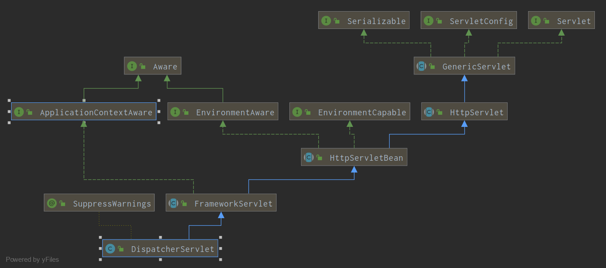

# SpringMVC启动

Java配置Spring MVC程序逐渐成为主流，传统的xml配置逐渐退出舞台，尤其是Springboot的逐渐流行，约定优于配置和内嵌Tomcat逐渐成为搭建Web服务器尤其是Restful风格的接口的后端的首选。

Servlet3.1标准中的4.4中定义了javax.servle.ServletContainerInitializer接口，实现了此接口的类，在对应的web application的启动过程中会被调用onStartup方法，此类的@HanldesType注解接收一个class对象（记为A），当这个实现被调用onStartup方法时，第一个参数是Class对象的set，里面包含了当前classpath上所有的A的子类（子接口，抽象类）的Class对象

对于SpringMVC来说，spring-web包下有个类SpringServletContainerInitializer实现了ServletContainerInitializer接口，并且注解了@HandlesTypes(WebApplicationInitializer.class)，那么web容器在启动web容器时会调用SpringServletContainerInitializer的onStartup方法，传入Classpath上的WebApplicationInitializer实现类：

```java
    @Override
    public void onStartup(@Nullable Set<Class<?>> webAppInitializerClasses, ServletContext servletContext)
            throws ServletException {

        List<WebApplicationInitializer> initializers = new LinkedList<>();

        if (webAppInitializerClasses != null) {
            for (Class<?> waiClass : webAppInitializerClasses) {
                // Be defensive: Some servlet containers provide us with invalid classes,
                // no matter what @HandlesTypes says...
                if (!waiClass.isInterface() && !Modifier.isAbstract(waiClass.getModifiers()) &&
                        WebApplicationInitializer.class.isAssignableFrom(waiClass)) {
                    try {
                        initializers.add((WebApplicationInitializer) ReflectionUtils.accessibleConstructor(waiClass).newInstance());
                    }
                    catch (Throwable ex) {
                        throw new ServletException("Failed to instantiate WebApplicationInitializer class", ex);
                    }
                }
            }
        }

        if (initializers.isEmpty()) {
            servletContext.log("No Spring WebApplicationInitializer types detected on classpath");
            return;
        }

        servletContext.log(initializers.size() + " Spring WebApplicationInitializers detected on classpath");
        AnnotationAwareOrderComparator.sort(initializers);
        for (WebApplicationInitializer initializer : initializers) {
            initializer.onStartup(servletContext);
        }
    }
```

1. 遍历传入的WebApplicationInitializer的Set，对于真正的实现类(非接口、非抽象类)，调用空参数构造方法来构造实例
2. 调用AnnotationAwareOrderComparator的实例的@Order和@Priority注解值来排序所有的实例
3. 按顺序调用initializer的onStartup方法，其中参数传入当前的servletContext

## 1.1 AbstractDispatcherServletInitializer的onStart()方法

```java
    @Override
    public void onStartup(ServletContext servletContext) throws ServletException {
        super.onStartup(servletContext);
        registerDispatcherServlet(servletContext);
    }
```

1. 调用父类AbstractContextLoaderInitializer的onStartup方法
2. 在web容器的servletContext中注册DispatcherServlet

### 1.1.1 AbstractContextLoaderInitializer的onStartup方法

```java
    @Override
    public void onStartup(ServletContext servletContext) throws ServletException {
        registerContextLoaderListener(servletContext);
    }
```

```java
    protected void registerContextLoaderListener(ServletContext servletContext) {
        WebApplicationContext rootAppContext = createRootApplicationContext();
        if (rootAppContext != null) {
            ContextLoaderListener listener = new ContextLoaderListener(rootAppContext);
            listener.setContextInitializers(getRootApplicationContextInitializers());
            servletContext.addListener(listener);
        }
        else {
            logger.debug("No ContextLoaderListener registered, as " +
                    "createRootApplicationContext() did not return an application context");
        }
    }
```

1. 创建根WebApp上下文
2. 创建ContextLoaderListener
3. 在第2步创建的ContextLoaderListerner中放入自定义的RootApplicationContextInitializers
4. 将创建的ContextLoaderListener放入web容器的serlectContext

#### 1.1.1.1 根据@Configuration注解的类，创建WebApp上下文

```java
    protected WebApplicationContext createRootApplicationContext() {
        Class<?>[] configClasses = getRootConfigClasses();
        if (!ObjectUtils.isEmpty(configClasses)) {
            AnnotationConfigWebApplicationContext context = new AnnotationConfigWebApplicationContext();
            context.register(configClasses);
            return context;
        }
        else {
            return null;
        }
    }
```

1. 获取自定义的所有RootConfigClass
2. 初始化一个新的AnnotationConfigWebApplicationContext
3. 注册第1步获得的rootConfigClasses到第2步初始化的AnnotationConfigWebApplicationContext

##### 1.1.1.1.1 获取自定义的所有RootConfigClass

##### 1.1.1.1.2 初始化AnnotationConfigWebApplicationContext

对比AnnotationConfigWebApplicationContext和ClassPathXmlApplicationContext的类图，可以发现两者全部都继承了AbstractRefreshableConfigApplicationContext，区别在于后者父类为AbstractXmlApplicationContext，内部实现了一些xml中扫描配置等相关的逻辑，而前者继承AbstractRefreshableWebApplicationContext，并且在共有的父类基础上，额外实现了几个其他的接口：

- WebApplicationContext接口:serletContext相关的方法，request scope相关的常量定义
- AnnotationConfigRegistry接口:使用注解类配置上下文的方法

AnnotationConfigWebApplicationContext的init过程与xml类型的区别：

1. 默认的ClassLoader是Servlet容器启动当前Webapp的ClassLoader
2. resourcePatternResolver是ServletContextResourcePatternResolver实例
3. 将DisplayName从```obj.getClass().getName() + "@" + getIdentityHexString(obj)```替换成```"Root WebApplicationContext"```

##### 1.1.1.1.3 注册rootConfigClasses

将对应的注解过的Class对象添加到上下文的annotatedClasses属性中

#### 1.1.1.2. 创建ContextLoaderListener

1. 静态代码块：初始化ContextLoader的默认strategy
2. 构造器与父构造器

##### 1.1.1.2.1 初始化ContextLoader的默认strategy

```java
    try {
        ClassPathResource resource = new ClassPathResource(DEFAULT_STRATEGIES_PATH, ContextLoader.class);
        defaultStrategies = PropertiesLoaderUtils.loadProperties(resource);
    }
    catch (IOException ex) {
        throw new IllegalStateException("Could not load 'ContextLoader.properties': " + ex.getMessage());
    }
```

1. 初始化ClassPathResource:```new ClassPathResource(DEFAULT_STRATEGIES_PATH, ContextLoader.class)```
2. 调用PropertiesLoaderUtils工具类的相关方法来读取properties，在spring-web的context包下面，有ContextLoader.properties文件，内部定义默认的org.springframework.web.context.WebApplicationContext=org.springframework.web.context.support.XmlWebApplicationContext

### 1.1.2. 在web容器的servletContext中注册DispatcherServlet

```java
    protected void registerDispatcherServlet(ServletContext servletContext) {
        String servletName = getServletName();
        Assert.hasLength(servletName, "getServletName() must not return null or empty");

        WebApplicationContext servletAppContext = createServletApplicationContext();
        Assert.notNull(servletAppContext, "createServletApplicationContext() must not return null");

        FrameworkServlet dispatcherServlet = createDispatcherServlet(servletAppContext);
        Assert.notNull(dispatcherServlet, "createDispatcherServlet(WebApplicationContext) must not return null");
        dispatcherServlet.setContextInitializers(getServletApplicationContextInitializers());

        ServletRegistration.Dynamic registration = servletContext.addServlet(servletName, dispatcherServlet);
        if (registration == null) {
            throw new IllegalStateException("Failed to register servlet with name '" + servletName + "'. " +
                    "Check if there is another servlet registered under the same name.");
        }

        registration.setLoadOnStartup(1);
        registration.addMapping(getServletMappings());
        registration.setAsyncSupported(isAsyncSupported());

        Filter[] filters = getServletFilters();
        if (!ObjectUtils.isEmpty(filters)) {
            for (Filter filter : filters) {
                registerServletFilter(servletContext, filter);
            }
        }

        customizeRegistration(registration);
    }
```

1. 获取servletName，默认为"dispatcher"
2. 创建一个servletAppContext:流程如[1.1.1.1](#1.1.1.1)，创建一个AnnotationConfigWebApplicationContext，区别是获取的ConfigClass是调用```getServletConfigClasses()```方法获取的Class数组
3. 创建dispatcherServlet，其中初始化参数中的WebApplicationContext为第2步初始化的WebApplicationContext
4. 处理Filter等

#### 1.1.2.1 初始化dispatcherServlet

```java
    protected FrameworkServlet createDispatcherServlet(WebApplicationContext servletAppContext) {
        return new DispatcherServlet(servletAppContext);
    }
```



在1.1.1中，将创建的ContextLoaderListener放入web容器的serlectContext，**根据Servlet3.1规范4.4**，Servlet容器会调用servletContext上注册的所有ContextLoaderListener的contextInitialized方法，具体过程参见[ContextLoaderListener的contextInitialized方法](./WebContext_1_InitWebApplicationContext.md)
